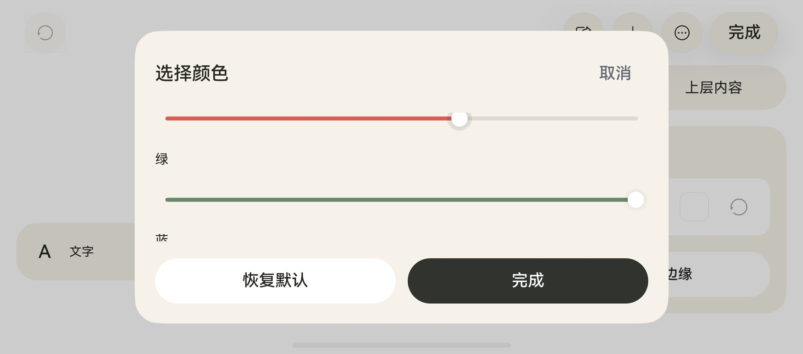
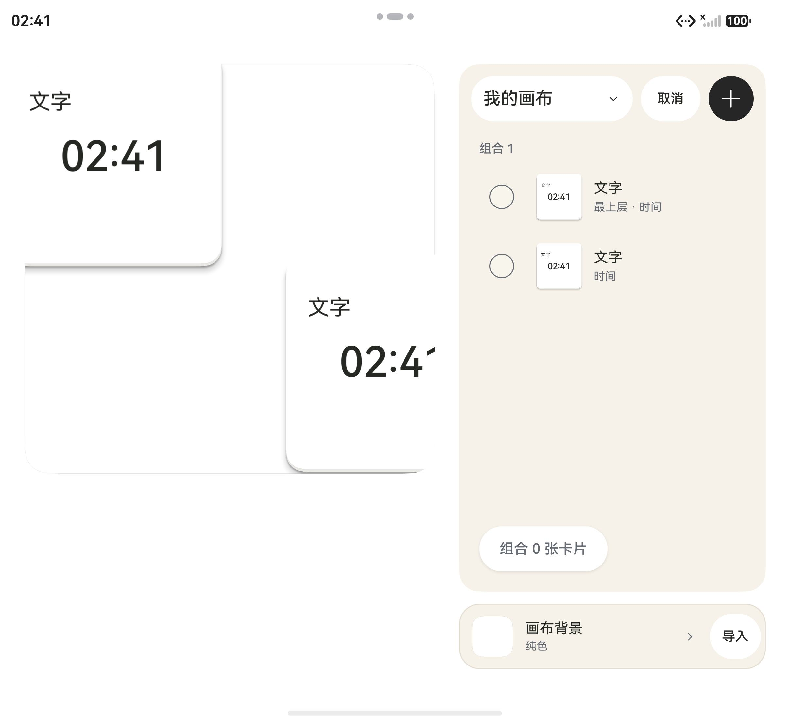

# v63 多设备 UI 复查（2026-10-06）

保留现有设计，使用官方 API 24 模拟器安装运行，非仅绘制尺寸模型。另在 MatePad Mini / HarmonyOS 7 / API 26 上采样 Release 模式构建的编辑过渡。

## 实际覆盖

| 设备 | 内屏 | 外屏 | 已执行 |
| --- | --- | --- | --- |
| Pura X Max，440 dpi | 2584×1828、1828×2584 | 1264×1848、1848×1264 | 首页、新建卡片、编辑、颜色面板；编辑和弹层打开时折叠、旋转；半折叠指令 |
| Mate X7，500 dpi | 2210×2416、2416×2210 | 1080×2444、2444×1080 | 首页、编辑、文字、时钟、能力选择、颜色面板滚动和展开后状态保留、分享、导入、组合、多选、拖动及旋转 |
| MatePad Mini，API 26 | 1600×2560 | 不适用 | 覆盖安装、启动、原有画布编辑进出，三轮帧时间采样 |

阔折叠展开横屏采用左右布局；普通折叠展开竖屏采用上下布局。外屏窄竖屏使用浮动工具区，外屏短横屏编辑采用左右布局。半折叠只验证模拟器状态指令和 App 持续运行，不代表已验证物理折痕及悬停姿态。

## 修复

1. CardFace 两层按卡片本体尺寸缓存，截断圆角下方原生阴影，出现灰色三角硬边。移除这两处缓存，主画布的 BoardCard 仍缓存包含阴影余量的整卡。原生截图复查硬边消失，保留厚度和阴影。
2. safeTop/safeBottom 更新没有直接触发首页布局。增加安全区变化监听重新计算，避免只变安全区时继续沿用旧坐标。
3. 短横屏的布局断点要求 220 vp 可用高度；大安全区导致折叠外屏错误切换成上下布局、挤掉设置区。调低短横屏阈值。按两台设备真实 dpi 换算 vp 后，覆盖内外屏、两种方向、三种安全区、五种画布比例，检查画布边界、面板边界和编辑控件高度预算。
4. API 24 颜色面板缺少短屏滚动。现在高度随窗口及安全区调整，RGB 区域原生 Scroll 滚动，顶部取消和底部完成/恢复默认保留。Mate X7 外屏横屏实际滚动，再展开，颜色和编辑状态保留。
5. 多选时仍显示占位的禁用编辑/删除按钮，窄栏卡片名称只剩一两字。多选时隐藏这两个无效操作，保留原生 Checkbox 和卡片行；正常状态按钮位置不变。

截图：

## 分享及组合

- 在 Mate X7 通过编辑页原生分享导出可编辑 .fridge 卡片，系统分享面板正常打开。
- 使用已导出的本地包走 EntryAbility 的 viewData 接收入口，原生预览确认后添加到画布。文字、时钟保留；接收的 received_*.fridge 副本在完成后被清理，原导出包保留。
- 两张卡片以原生 Checkbox 选择并组合，拖动其中一张，两张整体位移；旋转后组合标题和构图保留。测试刻意包含越出画布的卡片，画布裁切属于预期。
- 以上为同一模拟器导出/接收流程。跨设备投递未通过：HDC 无权写入另一模拟器的 App 私有目录，没有绕过文件授权，也没有把这个测试记作跨设备分享成功。含图片/GIF 的二进制完整性由既有模型测试覆盖，仍需真实跨设备授权接收验收。

## 性能

frame-results.json 为 MatePad 三轮编辑进出，在 hitrace 动画窗口内对齐 composer fps 时间戳得到的合成帧结果。进入约 71–73 fps，退出约 66–69 fps，最长帧间隔约 25 ms。设备合成帧是观测指标，不是逐组件帧率，也不代表达到最高刷新率。仍存在高刷新率优化空间；本轮不宣称性能已全部解决。脚本通过 HDC_TARGET 指定设备，保留本次真机坐标；换布局时应先 dumpLayout 重新校准。

## 验证与尚未覆盖

- 全部 22 个 tests/*.cjs 通过；Debug assembleHap、Release assembleApp 成功；git diff --check 通过。
- 原生键盘弹出触发模拟器首次键盘服务协议页面，未接受协议；键盘遮挡及键盘开启时折叠没有完成验收。
- 没有普通直板手机/折叠真机，本轮折叠 UI 验证使用官方模拟器；普通手机比例由外屏原生界面和既有布局回归补充，不等同直板手机真机验收。
- 桌面组件长期后台/重启冷恢复、含素材跨设备分享、各能力完整原生矩阵、满刷新率以及商店审核仍未验收。v61/v62 已完成项目不重复宣称。
